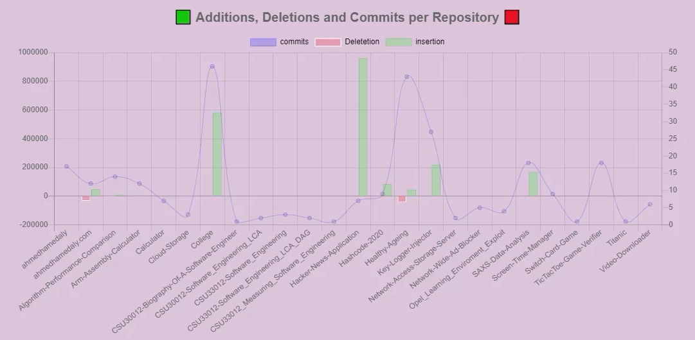

# CSU33012 GitHub Visualiser

<!-- Badges -->

<!-- Badges -->

Integrating the **[GitHub REST API v3](https://developer.github.com/v3/)** to build a visualisation of the data available to elucidate an aspect of the software engineering process using the **[D3js](https://d3js.org)** library to visualise the data.

## Getting Started

> Integrate the GitHub API to retrieve and display data regarding the logged in developer: **[HERE](https://github.com/ahmedhamedaly/CSU33012-GitHub-Visualiser/releases/tag/v1.0)**

> Integrate the GitHub API to build a visualisation of data available that elucidates some aspect of the software engineering process, such as a social graph of developers and projects, or a visualisation of individual of team performance: **[CURRENT](https://github.com/ahmedhamedaly/CSU33012-GitHub-Visualiser/)**

## Prerequisites

The project requires **Docker** to be installed. Please see below the instructions for downloading Docker on your device:

* **[Windows](https://www.docker.com/products/docker-desktop)**
* **[Mac OS](https://www.docker.com/products/docker-desktop)**
* **[Ubuntu](https://docs.docker.com/engine/install/ubuntu/)**

For a less restricted access experience to the GitHub API, you will need an Auth Token which can be found in your **[settings](https://github.com/settings/tokens)**.

## Installation

To run this project you need to clone the repository:\
```git clone https://github.com/ahmedhamedaly/CSU33012-GitHub-Visualiser.git```\
```cd CSU33012-GitHub-Visualiser```

Build the Docker Image for the Server:\
```docker build -t github-visualiser .```

Run the following command to run the container server:\
```docker run -d --name github_visualiser -p 80:80 github-visualiser```

## Usage

To view the GitHub visualiser, visit:\
```localhost:80```

On the page, there will be 2 user inputs, GitHub username and Auth Token. For a less restricted access experience of the GitHub API, you will need an Auth Token which can be found in your **[settings](https://github.com/settings/tokens)**. This will allow you (as the user) to not be restricted to 60 API calls (which equates to about 2-3 users depending on the number of repositories they have) and instead be allowed 600 API calls which are plenty for testing out the visualiser.

To stop the container, we need to use the name we set earlier to the container, which is `github_visualiser` if you're following along. So all you have to do is:\
```docker stop github_visualiser```

## Demo

The following is a short demonstration of the GitHub Visualiser with, firstly me (`ahmedhamedaly`) and then secondly `torvalds`.


I'm using a Ryzen 5 2600 3.4GHz CPU which would explain the fast load times of the data. This would normally take 10-15 seconds on an average computer (college lab computers) for an average user.

The 3 aspects of measuring software engineering I focused on were:

* Programming Languages used by the User.
* Amount of commits per day.
* Total code added/remove per repository.

The first aspect is that the more proficient a user is at a particular programming language, the more that user uses the language which corresponding to the ratio amount on the pie chart.


The second aspect is that the user can view the number of commits per day of the week to assess which day of the week you're most productive. In the following chart, it shows that I am most productive on Thursdays and least productive on Wednesday. Using this information I could adjust my schedule to tailor more to my productive days.


The last aspect is to measure if the number of insertions and deletion vs commits would have any correlation. From the graph, you can see that the amount of insertions vs deletion doesn't correlate to the number of commits. eg. my `hacker-new-application` repository has the most insertions but has low commits whereas my `healthy-ageing` repository has low insertions but a high amount of commits.

